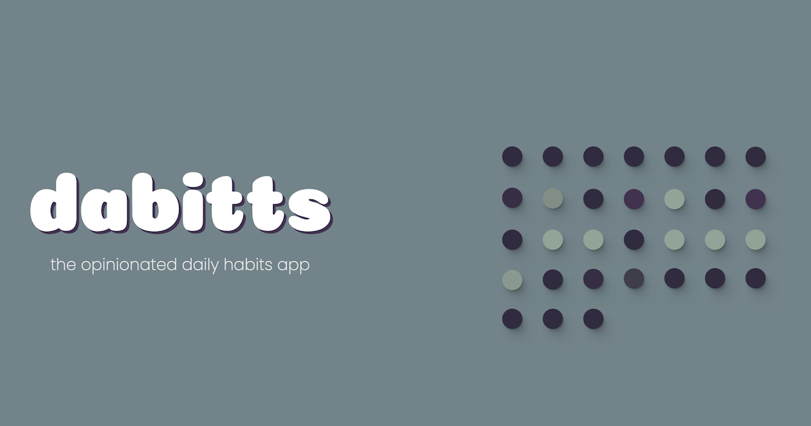

## dabitts - the daily habits app



## About

dabitts was a side project mainly created to expand my understanding of how to build a full stack application with features like authentication, theme providers, and using Next.js with a node backend. The site itself is meant to serve as a low friction to do app that also provides analytics on where and how you have been spending the majority of your time.

Overall, I had a ton of fun working on the project and learned a lot about how to get a full stack project from ideation to deployed.

You can checkout the final hosted product at: https://dabitts.com/

## Design

I make all my Figma mocks publicly available for those curious about my design process or just want to tinker with the layout in their own way. For dabitts those mocks can be seen [here](https://www.figma.com/file/LoKNyIlURUBre5Bati0ZD8/Dabit?node-id=0%3A1). Additionally, all assets on the site are available in the [assets folder](./public/assets/) of this repo.


## Running Locally

This project has a few third party dependencies as well as a [corresponding node backend](https://github.com/Augericke/dabitt-backend) that needs to be setup before you can run the app locally.

#### Auth0

On the frontend the project uses [Auth0](https://auth0.com/) for authentication which requires the following env variables to be set in a <i>.env.local</i> file.

```bash
NEXT_PUBLIC_AUTH0_PUBLIC_DOMAIN = "https://[YOUR-AUTH0-DOMAIN]";
NEXT_PUBLIC_AUTH0_PUBLIC_CLIENT_ID = "[YOUR-AUTH0-CLIENT-ID]";
NEXT_PUBLIC_AUTH0_PUBLIC_AUDIENCE = "[YOUR-AUTH0-AUDIENCE]";
```

Once the above, as well as the set up for the [node backend](https://github.com/Augericke/dabitt-backend) is configured you can run the development server:

```bash
npm run dev
# or
yarn dev
```

Open http://localhost:3000 with your browser to see the result.

## Feedback

Any and all feedback is welcome - you can either create a PR for this repo or connect with me over twitter [@augericke](https://twitter.com/augericke). I really appreciate those who stop by to take a look at the things I make and even more so those who try to help me improve - so truly thank you in advance!
